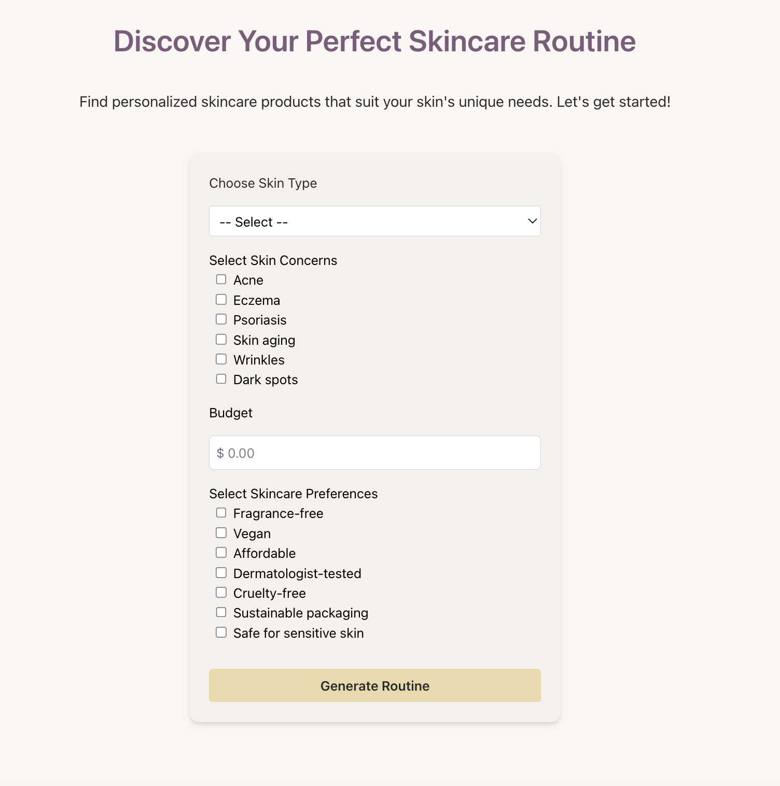
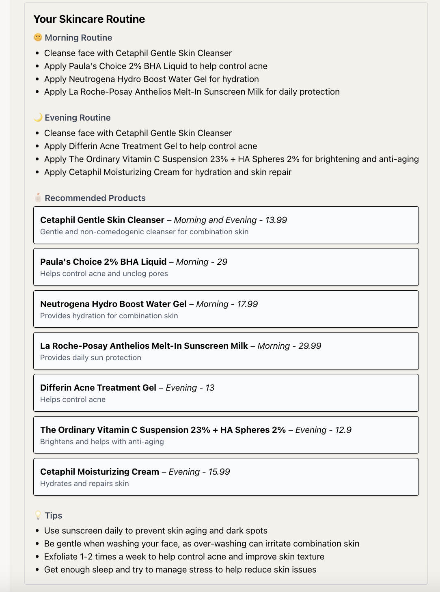

# 💆‍♀️ Skincare AI  
Your personalized skincare assistant powered by AI. Analyze ingredients, discover new products, and build a personalized skincare routine with a clean, fast, and modern UI.

🔗 **Live Demo:** [skincare-ai.vercel.app](https://skincare-ai.vercel.app)

---

## 🧑‍💻 About the Project  
Skincare AI helps users make informed skincare decisions by leveraging Groq Cloud’s LLM API. The project explores how AI can simplify the process of understanding products and building effective routines. It features a responsive interface built with Next.js and Tailwind CSS, and is developed with TypeScript for scalability and maintainability.

---

## 📸 Screenshots  

<div align="center" style="display: flex; justify-content: center; gap: 20px; flex-wrap: wrap;">
  <div style="flex: 1; max-width: 400px;">
    
    <p><em>Enter your skincare concerns and preferences.</em></p>
  </div>
  <div style="flex: 1; max-width: 400px;">
    
    <p><em>View your skincare routine powered by AI suggestions tailored to your skin needs.  </em></p>
  </div>
</div>


---

## 💡 Key Features    
- 🧴 **Routine Recommendations** – Get AI-generated skincare routines based on your skin profile.  
- 💬 **Smart Insights** – Understand potential irritants and compatibility with your skin type.  

---

## 🛠️ Tech Stack  
**Framework:** Next.js  
**Language:** TypeScript  
**Frontend:** React, Tailwind CSS  
**AI Integration:** Groq Cloud’s LLM API  

---

## 🚀 Getting Started  

### **Prerequisites**  
- Node.js 18+  
- npm or yarn
- Groq Cloud Developer Account  


### Installation
1. Clone the repository

```bash
git clone https://github.com/yourusername/skincare-ai.git
cd skincare-ai
```

2. Install dependencies

```bash
npm install
# or
yarn install
```

3. Run the development server

```bash
npm run dev
# or
yarn dev
```

4. Open [http://localhost:3000](http://localhost:3000) in your browser

5. Enjoy exploring new skin care routines and products!


## 📝 License

This project is licensed under the MIT License - see the [LICENSE](LICENSE) file for details.

## ⚠️ Disclaimer

This project is for educational and experimental purposes only.
It is not a medical or dermatological tool and should not replace professional advice.

## 🙏 Acknowledgments
- The skincare science community for open data and research  
- Open-source contributors and the React ecosystem  
- Everyone working to make skincare knowledge more transparent  


## 📞 Connect with Me

[LinkedIn](https://www.linkedin.com/in/deepprajapati) -
[Github](https://github.com/dprajapati4/)
